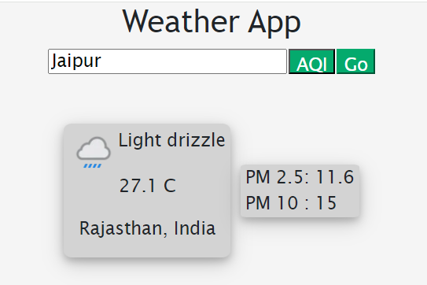
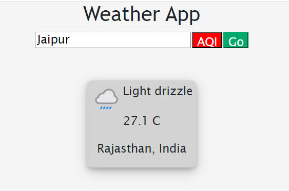

# My Weather App

## Description:
A react app to know the weather of a city.

## Table of Contents

- [Architecture](#architecture)
- [Installation](#installation)
- [Usage](#usage)
- [Screenshots](#screenshots)
- [Contributing](#contributing)
- [Additional Information](#addinfo)

## Architecture :
`index.js`: Render the app\
`Appp.js`: Create the view and get data from api\
`Aqi.jsx`: Component to display Aqi\
`Weather.jsx`: Component to display the weather data\
`Spinner`: Display spinner while data is loading\
`App.css`: Styles

## Installation :
To install the project, follow these steps:

Clone the repository: `https://github.com/pnaruka/my-weather-app`\
Navigate to the project directory: `cd my-weather-app`

Install dependencies: `npm install`

## Usage :
After installation, you can use the project as follows:

Run the project: `npm start`\
Access the application through your web browser at `http://localhost:3000` \

## Screenshots :
`With AQI`:  \
`Without AQI`:  

## Contributing :
Contributions are welcome! Here's how you can contribute:\
Fork the repository\
Create a new branch: `git checkout -b feature`\
Make your changes and commit them: `git commit -am 'Add new feature'`\
Push to the branch: `git push origin feature`\
Submit a pull request

## Additional Information 

For additional information or support, please contact the project maintainers at pankajnaruka111@gmail.com.